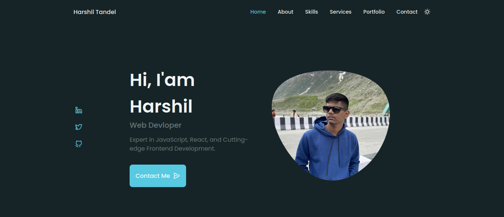

# Harshil Tandel's Portfolio 🌐

Welcome to my personal portfolio repository! This site showcases my skills, projects, and contact information.

## Technologies Used 🛠️

- HTML
- CSS 
- JavaScript
- React.js

## Features ✨

- Responsive design
- Interactive elements
- Project showcase
- Contact form

## Getting Started 🚀

To view the portfolio:

1. Clone this repository: `git clone https://github.com/HarshilTandel/Portfolio.git`
2. Navigate to the project directory
3. Open `index.html` in your browser

## Screenshots 🖼️

## Live Demo 🌐

Explore the live version: [Harshil Tandel's Portfolio](https://harshil-tandel.netlify.app/)

## Contact 📬

Feel free to reach out to me!

- Email: harshil.tndll@gmail.com 📧
- LinkedIn: [Harshil Tandel](https://www.linkedin.com/in/harshil-tandel-/) 🔗
- GitHub: [HarshilTandel](https://github.com/HarshilTandel) 🔗
- Twitter: [HarshilTandel07](https://x.com/HarshilTandel07)🔗
---

Thank you for visiting my portfolio! I hope you find it informative and engaging. 😊
